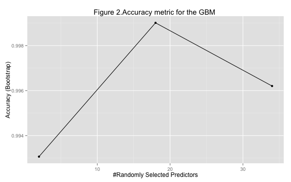
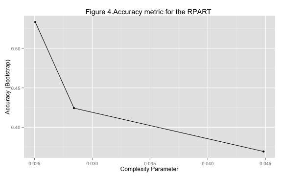

The goal of the project is to predict the manner in which some individuals perform physical exectcises. In order to make predictions several machine learning algorithms have been tested, such as random forest (RF), recursive partitioning and regression trees(RPART), generalized boosted regression model(GBM), linear discriminant analysis(LDA). Taking into account  multicollinearity among predictors the dataset was initially  preprocessed with the principal component technique. RF and GBM appeared to show pretty good predictions with very high level of accuracy. 

##1.Context
Six participants were asked to perform one set of 10 repetitions of the Unilateral Dumbbell Biceps Curl in five different fashions: exactly according to the specification (Class A), throwing the elbows to the front (Class B), lifting the dumbbell only halfway (Class C), lowering the dumbbell only halfway (Class D) and throwing the hips to the front (Class E).Class A corresponds to the specified execution of the exercise, while the other 4 classes correspond to common mistakes. Each of participants was provided with accelerometers on the belt, forearm, arm, and dumbell to scan various characteristics of the position of the body (mostly their arms and forearms) and equipment. 
The data are courteousely provided by a group of researchers and downloaded from the site http://groupware.les.inf.puc-rio.br/har.

##2.Project strategy outline

The project consists of two main steps: data preparations and model selection. At the Data preparation step  data are being cleaned and dimension of the matrix of the predictors is reduced. At the Model selection step four algorithms are being considered: RF, GBM, LDA and RPART. For each algorithm accuracy metrics are computed. The model (or models) with the highest level of accuracy is retained.


##3.Data preparation

Data preparation comprises too stages: cleaning and preprocessing.

###3.1. Data cleaning

The data contain more than 150 statistical measurements of the body kinematics and kinetics accompanying with 3-D physical readings corresponding to the dumbell and belt positions. These measurements are collectively called predictors. Each row of the data stacks predictors for the certain way (or "classe") of the execution  of the weight liftnig performed by one of the six participants (their names are given). There is also detailed information about the time when the measurements are taken. 

Despite of a myriad of characteristics the data matrix is sparsed (a lot of observations are inavailable).The main objective of this stage is to clean the data while keeping as much information as possible. It may be achieved either through removing predictors with high rate of NA values or deleting rows where at least one of the predictors has a NA value. When removing a predictor altogether we may lose a valuable information, so a better way to proceed is to prune predictors with the highest number of NA values and then deciding what to to with the others. In order to get the data clean and make the machine learning algorithms more robust the following steps have been taken:

* Primarely, all the blank observations and observations marked as "DIV/0!" were replaced with NA values.

* Predictors containg more than 50% of NA values were removed.

All in all 59 predictors remained in the dataset. None of them helds NA values, thus this stage is completed.


```r
dattrain = read.csv("http://d396qusza40orc.cloudfront.net/predmachlearn/pml-training.csv") #downloading of the data
dattest = read.csv("http://d396qusza40orc.cloudfront.net/predmachlearn/pml-testing.csv") #downloading of the data
ddt<-dattrain[dattrain==""|dattrain=="#DIV/0!"]<-NA #assigning NA values to blank and invalid observations
nameNotNA<-data.frame(name=sapply(colnames(ddt),function(x){ifelse((sum(is.na(ddt[,x]))/dim(ddt)[1])>0.5, "",x)}),stringsAsFactors=FALSE) #selecting clean predictors
dt<-ddt[,colnames(ddt) %in% nameNotNA] #selecting clean predictors
```


###3.2. Data preprocessing
Quick analysis of the correlation matrix (non-numerical predictors are left out) suggests the presence of a nontrivial multicollinearity. That's why it's a good idea to reduce the dimension of the matrix of predictors. This has been done by means of the Principal component analysis. Finally only about thirty independent variables have been kept. It's justified not only from the statistical point view, but physically it's also correct, for most of the kinematic readings reproduces similiar body motions.


```r
dtP<-sapply(colnames(ddt),function(x){as.numeric((ddt[,x]))}) #converting integer to numeric
dtP<-preProcess(dtP,method="pca",threshold=0.95) #preprocessing with PCA
dtP<-c(dtP,ddt[,c(1,2,3,4,5,58)]) #joinig PC with non-numeric predictors
```

##4. Estimation of the model performance

Most of the machine learning algorithms has built-in cross-validation techniques. According to Leo Breiman and Adele Cutler (https://www.stat.berkeley.edu/~breiman/RandomForests/cc_home.htm) "in random forests, there is no need for cross-validation or a separate test set to get an unbiased estimate of the test set error". It's done internally  through different bootstrap samples taken from the original data. The same is applied to the other models choosen for the project (GMB,LDA,RPART).

Nevetheless, k-fold cross validation technique was used for LDA and RPART algorithms (k is 10). Obviuosly, there was no difference in the predictions generated with different cross-validation techniques.
By default each model is provided with a set of the accuracy estimators. RF generates additionally out-of-bag estimate of error rate. These characteristics were used to estimate the expected misspecification. RMSE metrics is not meaningful for factors.


```r
train_control <- trainControl(method="cv", number=10) # 10-folds cross-validation
```

##5.Model selection

###5.1. Random forest

The random forest technique was realized with two sets of data. The first set  contained about sixty original predictors stripping of NA values. The second set contained only principal components and non-numerical predictors.Results for the both of the sets are almost identical having  accuracy and kappa parameters very close to 1. The closer to 1 these estimators the better a model.The optimal number of predictors is 18 and out-of-bag error is pretty small (6%).


```r
print(modRFP1) # results of the RF model
```

```
## Random Forest 
## 
## 19622 samples
##    29 predictor
##     5 classes: 'A', 'B', 'C', 'D', 'E' 
## 
## No pre-processing
## Resampling: Bootstrapped (25 reps) 
## 
## Summary of sample sizes: 19622, 19622, 19622, 19622, 19622, 19622, ... 
## 
## Resampling results across tuning parameters:
## 
##   mtry  Accuracy   Kappa      Accuracy SD   Kappa SD    
##    2    0.9930664  0.9912277  0.0011337072  0.0014371823
##   18    0.9990126  0.9987509  0.0004186983  0.0005296752
##   34    0.9962042  0.9951985  0.0010368378  0.0013100077
## 
## Accuracy was used to select the optimal model using  the largest value.
## The final value used for the model was mtry = 18.
```


```r
ggplot(modRFP1)+labs(title="Figure 1.Accuracy metric for the RF ")
```

 

###5.2. GBM

The model was realized  only for the reduced data set. It also delivers very high level of accuracy. The model was tested twice:with bootstrapped resampling and 10-folds cross-validation.


```r
print(modBP1) # results of the GBM model
```

```
## Stochastic Gradient Boosting 
## 
## 19622 samples
##    29 predictor
##     5 classes: 'A', 'B', 'C', 'D', 'E' 
## 
## No pre-processing
## Resampling: Bootstrapped (25 reps) 
## 
## Summary of sample sizes: 19622, 19622, 19622, 19622, 19622, 19622, ... 
## 
## Resampling results across tuning parameters:
## 
##   interaction.depth  n.trees  Accuracy   Kappa      Accuracy SD 
##   1                   50      0.6926939  0.6070819  0.0066230278
##   1                  100      0.7824802  0.7236085  0.0054927003
##   1                  150      0.8382114  0.7948065  0.0060117888
##   2                   50      0.9031816  0.8773374  0.0065417413
##   2                  100      0.9825689  0.9779373  0.0032343980
##   2                  150      0.9946013  0.9931688  0.0008871362
##   3                   50      0.9671212  0.9583777  0.0043009342
##   3                  100      0.9950393  0.9937230  0.0008513967
##   3                  150      0.9973262  0.9966166  0.0005413247
##   Kappa SD    
##   0.0084187645
##   0.0069945551
##   0.0076035670
##   0.0082956476
##   0.0040888592
##   0.0011213408
##   0.0054591748
##   0.0010758100
##   0.0006837015
## 
## Tuning parameter 'shrinkage' was held constant at a value of 0.1
## 
## Tuning parameter 'n.minobsinnode' was held constant at a value of 10
## Accuracy was used to select the optimal model using  the largest value.
## The final values used for the model were n.trees = 150,
##  interaction.depth = 3, shrinkage = 0.1 and n.minobsinnode = 10.
```


```r
ggplot(modRFP1)+labs(title="Figure 2.Accuracy metric for the GBM ")
```

 

###5.3.Linear discriminant analysis

The model was tested with bootstrapped resampling and 10-folds cross-validation and according to accuracy and Kappa parameters performs much worse than the previous models.


```r
print(modLMP) #results of the LDA model
```

```
## Linear Discriminant Analysis 
## 
## 19622 samples
##    29 predictor
##     5 classes: 'A', 'B', 'C', 'D', 'E' 
## 
## No pre-processing
## Resampling: Bootstrapped (25 reps) 
## 
## Summary of sample sizes: 19622, 19622, 19622, 19622, 19622, 19622, ... 
## 
## Resampling results
## 
##   Accuracy   Kappa      Accuracy SD  Kappa SD   
##   0.5860062  0.4754809  0.004432209  0.005334207
## 
## 
```


```r
ggplot(modRFP1)+labs(title="Figure 3.Accuracy metric for the LDA ")
```

 

###5.4. RPART
The model was tested with 10-folds cross-validation and it doesn't delivers a good performance.


```r
print(modRPP1) #results of the RPART model
```

```
## CART 
## 
## 19622 samples
##    29 predictor
##     5 classes: 'A', 'B', 'C', 'D', 'E' 
## 
## No pre-processing
## Resampling: Bootstrapped (25 reps) 
## 
## Summary of sample sizes: 19622, 19622, 19622, 19622, 19622, 19622, ... 
## 
## Resampling results across tuning parameters:
## 
##   cp          Accuracy   Kappa      Accuracy SD  Kappa SD  
##   0.02506765  0.5333867  0.4093011  0.04673105   0.05928867
##   0.02841476  0.4243774  0.2500390  0.03359530   0.05286213
##   0.04482980  0.3693714  0.1544178  0.05502960   0.09834776
## 
## Accuracy was used to select the optimal model using  the largest value.
## The final value used for the model was cp = 0.02506765.
```


```r
ggplot(modRPP1)+labs(title="Figure 4.Accuracy metric for the RPART ")
```

 

##6.Conclusion
Acorrding to the accuracy parameters RF and GBM models are by far the best methods to pick up. They give identical predictions and will be kept for the submission. Given the accuracy parameters we may guess no more than two misspecification cases within train set. The only thing to take into consideration is a relatively long time needed to get the models done(especially the rf model).


